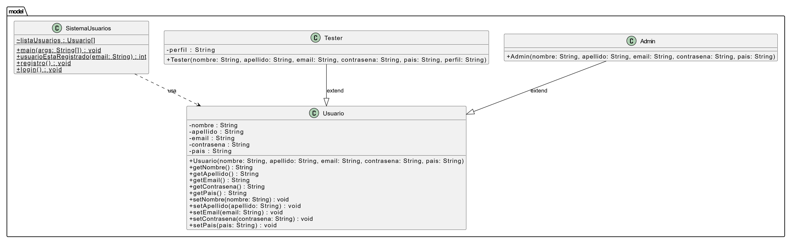

# Funcionalidades del sistema

## Usuarios no autenticados

### Inicio de sesión de administración
Permite a un administrador iniciar sesión en el sistema.

**Datos requeridos:**
- Email
- Contraseña

### Reiniciar contraseña
Permite reiniciar la contraseña de un usuario mediante su email.

**Datos requeridos:**
- Email
- Nueva contraseña
- Repetir nueva contraseña

### Creación de cuenta de administrador
Permite registrar un nuevo usuario administrador.

**Datos requeridos:**
- Nombre
- Apellido
- Email
- Contraseña
- Repetir contraseña

---

## Usuarios autenticados

### Cerrar sesión
Permite finalizar la sesión actual.

### Ver y editar datos personales
Permite visualizar y modificar información personal del usuario autenticado.

**Datos editables:**
- Nombre
- Apellido
- Email
- País

**Datos no editables:**
- Perfil

### Reiniciar contraseña
Permite reiniciar la contraseña de un usuario mediante su email.

**Datos requeridos:**
- Email
- Nueva contraseña
- Repetir nueva contraseña

### Crear usuario tester
Permite a un administrador registrar nuevos usuarios con perfil tester.

**Datos requeridos:**
- Nombre
- Apellido
- Email
- País de nacimiento
- Contraseña por defecto
- Perfil

### Visualizar usuarios
Permite listar todos los usuarios registrados en el sistema.

### Eliminar usuario
Permite eliminar usuarios que no tengan perfil administrador.

# Diagrama UML
